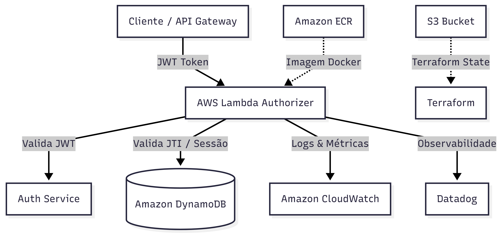

# Tech Challenge User Authorizer

Este repositório provisiona e gerencia o **User Authorizer**, uma função AWS Lambda responsável pela autenticação e autorização de usuários na plataforma. O sistema valida tokens JWT (JSON Web Tokens) e verifica a existência de sessões ativas em um banco de dados DynamoDB, garantindo a segurança das requisições.

## Tecnologias Utilizadas

*   **Go (Golang):** Linguagem principal do serviço Authorizer.
*   **Terraform:** Infraestrutura como Código (IaC) para provisionamento na AWS.
*   **AWS Lambda:** Execução de código serverless para autorização.
*   **Amazon DynamoDB:** Armazenamento de sessões e controle de tokens (JTI).
*   **LocalStack:** Emulação de serviços AWS para desenvolvimento local.
*   **Docker & Docker Compose:** Containerização e orquestração do ambiente de desenvolvimento.
*   **Datadog:** Monitoramento e observabilidade (opcional).

## Passos para Execução e Deploy

### Pré-requisitos

*   Docker e Docker Compose instalados.
*   Go 1.22 ou superior.
*   AWS CLI configurado.
*   Terraform 1.0.0 ou superior (para deploy na AWS).

### Execução Local (via LocalStack)

Para rodar o projeto localmente e testar as funcionalidades em um ambiente emulado:

1.  **Inicie o LocalStack:**
    ```bash
    docker compose up -d
    ```
2.  **Prepare o Banco de Dados:**
    Crie a tabela e uma sessão de teste inicial no DynamoDB local:
    ```bash
    make dynamodb-bootstrap
    ```
3.  **Realize o Deploy da Lambda:**
    Compile o binário e envie a função para o LocalStack:
    ```bash
    make deploy
    ```
4.  **Teste a Autorização:**
    Utilize o script de teste para gerar um token e validar a execução:
    ```bash
    ./scripts/test_local.sh
    ```

### Deploy Real na AWS

Para implantar a infraestrutura de produção na AWS:

1.  **Configure as Variáveis:**
    Crie ou ajuste seu arquivo de variáveis (`terraform.tfvars`) com as credenciais e tags de imagem necessárias.
2.  **Inicialize o Terraform:**
    ```bash
    cd terraform
    terraform init
    ```
3.  **Planeje e Aplique:**
    ```bash
    terraform plan
    terraform apply
    ```
    *Nota: Certifique-se de que a imagem Docker já esteja disponível no repositório ECR especificado.*

## Diagrama da Arquitetura




## APIs (Swagger/Postman)

*(em branco)*
